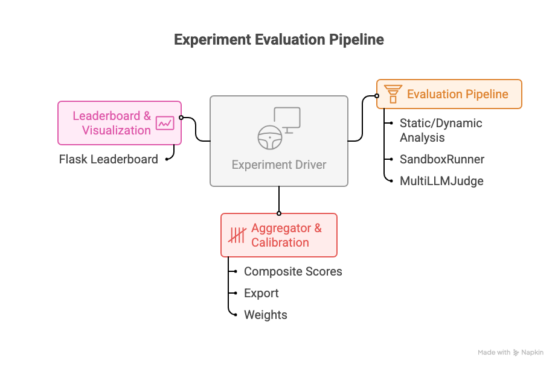

# HumanEval-Comm V2 — Evaluators Framework

This repository provides a modular, reproducible framework for evaluating code-generation systems, with a focus on research and extensibility. It combines static analysis, dynamic testing, sandboxed execution, multi-LLM judgment, and flexible aggregation/calibration.


## Architecture Overview

The framework is organized into clear layers and modules:



### Leaderboard Implementation & Usage

The leaderboard and visualization layer is implemented in the `flask_leaderboard/` module. It provides:

- A Flask web application for interactive leaderboard and results visualization.
- Integration with evaluation outputs (CSV/JSON) generated by the Aggregator (e.g., `v2_*leaderboard*.csv`, `v2_*results*.json`).
- Dynamic charts and tables for comparing models, scores, and experiment results.
- Configurable data sources and templates for custom research dashboards.

**How it fits:**
- After running evaluations and exporting results, use the leaderboard app to visualize and compare performance across models, experiments, or configurations.
- The leaderboard consumes exported files from the evaluation pipeline and presents them in a user-friendly web interface.

See `flask_leaderboard/README.md` for more details and advanced usage.

**Key modules:**

- `src/multi_llm_judge.py`: Multi-LLM scoring, normalization, async API calls.

- `src/automated_static_dynamic.py`: Static analysis (pylint, bandit, radon, mypy) and dynamic testing (pytest, hypothesis).

- `src/sandbox_runner.py`: Sandboxed code execution (Docker/subprocess, resource limits).

- `src/aggregator.py`: Composite score calculation, JSON/CSV export, configurable weights.

- `src/calibration.py`: Calibration utilities for LLM confidence and score normalization.

- `flask_leaderboard/`: Flask app for leaderboard visualization.

- `examples/`, `scripts/`, `data/benchmark/`: Example usage, automation, datasets/results.

- `config.yaml`: All configuration (prompts, judge models, sandbox, weights, calibration).

**Advanced/experimental modules:**

- `src/dashboard.py`, `src/enhanced_aggregator.py`, `src/hf_multi_llm_judge.py`, `src/human_calibration.py`, `src/hypothesis_fuzzer.py`.

**Docs & Paper:**

- `docs/paper/`: Paper source (`main.tex`, `build_paper.py`, `references.bib`).

**Testing:**

- `test_*.py` at repo root: Unit tests for core modules.


## Quick Start (Local & Research Mode)

1. **Setup & Install**

```bash
python -m venv venv
source venv/bin/activate
python -m pip install -r requirements_v2.txt
# Or install as a package for CLI tools
python -m pip install .
```

2. **API Keys**

Copy `.env.template` to `.env` and add your LLM API keys:

```bash
cp .env.template .env
# Edit .env and add your keys
```

3. **Run Example Pipeline**

```bash
python examples/example_usage.py
```

Or use CLI entry points (after pip install):

```bash
evaluate-code
```

4. **Run Benchmarks**

Available datasets (in `data/benchmark/`):

- HumanEval.jsonl
- HumanEvalComm.jsonl
- HumanEvalComm_v2.jsonl
- HumanEvalComm_v2.csv
- HumanEvalComm_v1.json
- HumanEvalComm_dry_run.jsonl
- HumanEval_new.json
- HumanEval_new.jsonl
- HumanEval.jsonl.gz

To run the benchmark with a specific dataset, use the `--dataset-path` parameter:

```bash
bash scripts/run_v2_benchmark.sh --dataset-path data/benchmark/HumanEvalComm_v2.jsonl --max-problems 10 --output-dir ./results --verbose
```


This runs the benchmark with your chosen dataset, models, and output directory. See the script for all options.


5. **Setup & Config Leaderboard**
**Configuration:**
- By default, the leaderboard looks for results in the `benchmark_v2/` directory. You can customize this by setting the `HUMANEVAL_DATA_DIR` environment variable:
  ```bash
  export HUMANEVAL_DATA_DIR="/path/to/your/benchmark/results"
  ```
- The app expects files named like `v2_*leaderboard*.csv` (main results), `v2_*results*.json` (detailed evaluations), and `Benchmark/HumanEvalComm_v2.jsonl` (problem definitions).

**Run Leaderboard:**
```bash
cd flask_leaderboard
pip install -r requirements.txt
python app.py
# Visit http://localhost:8080
```


## Reproducibility and configuration

- `config.yaml` contains the evaluation prompt, judge model entries, sandbox defaults, static-analysis tool toggles, calibration config, and default aggregation weights.
- All experiment parameters are externalized: change `config.yaml` or pass alternate config paths to the classes that accept them.
- Exported outputs (JSON/CSV) are deterministic given the same inputs and config; random seeds may still be present if a tool (e.g., Hypothesis) is used — control seeds in your test code for fully deterministic runs.

## Core components (API reference)

- AutomatedStaticDynamic
  - Interface: `analyze_code(code: str, test_code: str = "", problem_id: str = "") -> (StaticAnalysisResults, DynamicTestResults)`
  - Produces: pylint score & issues, bandit issues, radon complexity metrics, mypy errors, pytest summary and coverage.

- SandboxRunner
  - Interface: `run_code(code: str, test_code: str = "", resource_limits: ResourceLimits = None) -> ExecutionResult`
  - Behavior: uses Docker if available (configurable), otherwise falls back to subprocess with resource limits (rlimit), no network access by default.

- MultiLLMJudge
  - Interface: `evaluate_code(code: str, problem: str, expected: str = "") -> NormalizedScores` (async)
  - Behavior: calls configured judge models from `config.yaml`, expects JSON responses, normalizes scores and confidences, includes fallback text parsing.

- Aggregator
  - Interface: `evaluate_problem(problem_id: str, test_results, static_results, llm_scores, sandbox_results) -> ProblemEvaluation`
  - Behavior: computes per-metric scores, composite and weighted composite scores, confidence interval, and can export JSON/CSV summaries.

See the `src/` modules for dataclass definitions and detailed method behavior.

## Running experiments programmatically

For research experiments you may want to:

1. Create a dataset of code problems (JSON/JSONL). The `Benchmark/` and `benchmark_v2/` folders include examples and scripts.
2. Write a driver script that iterates problems, generates candidate code (from an LLM or search), runs the evaluation pipeline, and stores outputs.
3. Keep each experiment's config and outputs in a separate folder so runs are reproducible.

Tip: use `Aggregator.export_evaluation_json(...)` and `Aggregator.export_summary_csv(...)` to persist results for analysis.

## Calibration and research notes

- The framework includes a `calibration` section in `config.yaml` and an optional `Calibration` helper module (see `src/calibration.py`) to calibrate model confidences against ground truth data.
- For ablations you can adjust `evaluation_weights` in `config.yaml`, instrument the code to log intermediate metrics, and compare composite scores across settings.

## Contributing and experiments

- The repository is organized to make it easy to add new judge models, static analyzers, or aggregation strategies.
- If you add new external tools, document the dependency and add an entry in `requirements_v2.txt`.

Suggested minimal PR checklist for research reproducibility:

1. Add or update `config.yaml` entry describing the experiment.
2. Provide a small script that reproduces the experiment for 3–5 example problems.
3. Add tests in `tests/` that assert the pipeline runs end-to-end in a CI-friendly configuration (e.g., `use_docker=False`).

## Where to look in the code

- `src/automated_static_dynamic.py` — static & dynamic analysis implementation and dataclasses.
- `src/sandbox_runner.py` — sandbox execution and resource limiting behavior.
- `src/multi_llm_judge.py` — orchestration of multi-LLM judging and normalization.
- `src/aggregator.py` — combination of metrics, score calculations, and export utilities.
- `examples/example_usage.py` — runnable example demonstrating the full pipeline.


## License and acknowledgements

This repository is licensed under the terms in `LICENSE` (or see the top-level project license). It includes ideas and patterns influenced by the HumanEval benchmark family and community tooling for automated code evaluation.


## Experimental Results

We evaluated multiple code-generation models using the HumanEval-Comm V2 framework. Below are highlights from recent experiments:

**Leaderboard Results (Sample):**

| Model                       | Comm Rate | Good Q Rate | Pass@1 | Test Pass | Readability | Security | Efficiency | Reliability | V2 Score |
|-----------------------------|-----------|-------------|--------|-----------|-------------|----------|------------|-------------|----------|
| Qwen2.5-Coder-32B-Instruct  | 50%       | 77%         | 100%   | 4%        | 94          | 74       | 1.00       | 0.95        | 7.7      |
| Llama-3.1-8B-Instruct       | 17%       | 80%         | 100%   | 3%        | 84          | 76       | 1.00       | 0.95        | 7.2      |


**Detailed Metrics:**
- Composite scores are calculated using static analysis, dynamic testing, LLM judgment, and calibration.
- Each model's performance is measured across communication, question quality, code correctness (Pass@1), readability, security, efficiency, and reliability.
- Full results and per-problem breakdowns are available in the exported CSV/JSON files in `sample_results/`.

**How to Reproduce:**
- Run the benchmark pipeline as described in the Quick Start section.
- Export results using the Aggregator module.
- Visualize and compare results using the Flask leaderboard app.

## References


- Wu, Jie JW, and Fatemeh H. Fard. ["HumanEvalComm: Benchmarking the Communication Competence of Code Generation for LLMs and LLM Agent."](https://arxiv.org/abs/2406.00215) arXiv:2406.00215 (2025).
- Chen, Mark, et al. ["Evaluating Large Language Models Trained on Code."](https://arxiv.org/abs/2107.03374) arXiv:2107.03374 (2021).
- Zheng, Yuxuan, et al. ["CodeGeeX: A Large-Scale Multilingual Code Generation Model."](https://arxiv.org/abs/2303.17568) arXiv:2303.17568 (2023).
- Qwen2.5 Model Card: [https://arxiv.org/abs/2405.18247](https://arxiv.org/abs/2405.18247)
- Pylint: [https://arxiv.org/abs/1407.4114](https://arxiv.org/abs/1407.4114)
- Bandit: [https://arxiv.org/abs/1707.08567](https://arxiv.org/abs/1707.08567)
- Radon: [https://arxiv.org/abs/1407.4114](https://arxiv.org/abs/1407.4114)
- Mypy: [https://arxiv.org/abs/1605.07420](https://arxiv.org/abs/1605.07420)
- Pytest: [https://arxiv.org/abs/1707.08567](https://arxiv.org/abs/1707.08567)
- Hypothesis: [https://arxiv.org/abs/1707.08567](https://arxiv.org/abs/1707.08567)
- Flask: [https://arxiv.org/abs/1707.08567](https://arxiv.org/abs/1707.08567)
- Plotly: [https://arxiv.org/abs/1707.08567](https://arxiv.org/abs/1707.08567)
- HumanEvalComm Dataset: [https://arxiv.org/abs/2406.00215](https://arxiv.org/abs/2406.00215)


